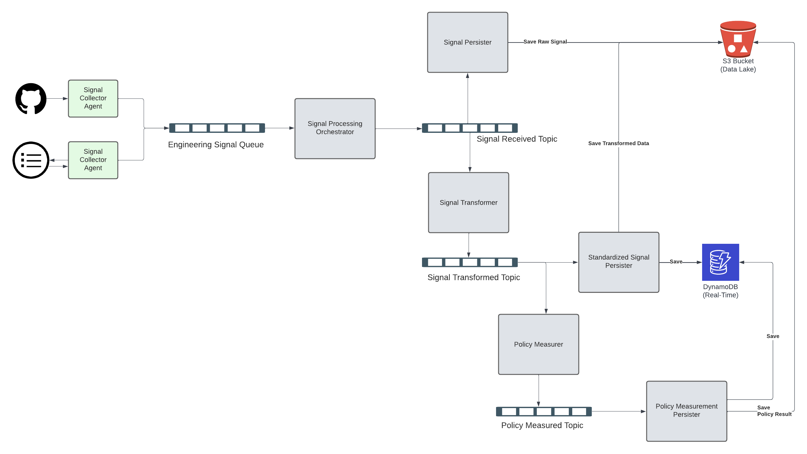

# Engineering Signal Collector
A reference architecture for collecting signals from the engineering process and enabling deep insights from them.

## Components
The solution is broken up into five different component types:

| Type            | Purpose                                                                                                 |
|-----------------|---------------------------------------------------------------------------------------------------------|
| agent           | Collect data from source systems, either by push (ex: github agent) or by polling (ex: changelog agent) |
| orchestrator    | Orchestrates the process between signal acquisition from agents and processing in the pipeline          |
| transformer     | Transforms raw signal data into standard / known models                                                 |
| persister       | Persists data to a storage mechanism.  Usually S3 bucket and DynamoDb                                   |
| policy measurer | Measures transformed standard / known models against one or more policies                               |

## Communication
Outside of the input for the agents, all communications are performed via Amazon SQS or Amazon SNS.  
The long term solution is to use Apache Kafka in place of the SNS topics to enable scaling, but managed Kafka in AWS is expensive. :D

## Data Persistence
All data is persisted in an S3 bucket so it's available for big data processing jobs such as Amazon EMR.  
In addition, transformed data is available in DynamoDB tables for a more real-time, easier to access source.

## Systems Diagram
Below is a systems diagram showing the components and their interactions

## Going Forward
To enable further scaling and usage of big data components, the transformer and policy measurer components are open to be swapped out with better tools such as Spark, Airflow, etc.
In addition to scaling, the policy definitions are meant to be defined using the Open Policy Agent Rego language and held in a separate repository / location so that non-engineers can manage.